## Hardware Acceleration of ZKP

### 1.Goals of HW Acceleration

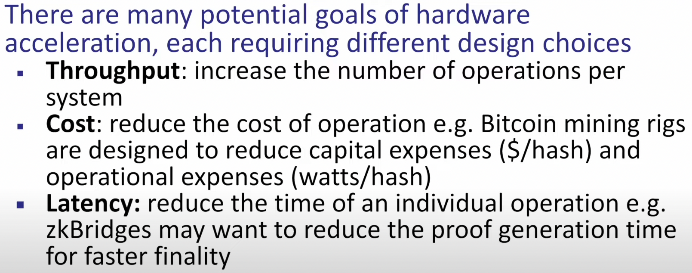

- 吞吐量，即每单位时间执行尽可能多的操作
- 成本
  - 当优化成本时，目标是降低执行某些操作所涉及的资本和运营费用。对于比特币挖掘机来说，这意味着最大化每美元购买价值的哈希数量，同时最小化每个哈希的能源消耗，从而降低运营成本。
- 延迟：减少完成单个操作的时间
  - 在高频交易等领域，延迟是一个重要的考虑因素。 低延迟的证明生成可以促进更好的用户体验或更快的确定用例，比如ZK Bridges。

###  2.What needs accelerated

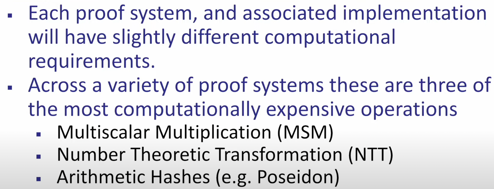

首先要注意的是每个证明系统及其相关实现都是利用不同的密码原语和不同的软件库构建的，在某一个证明系统中计算成本最高的部分，在另外不同的证明系统实现或用例中可能相对次要或可能根本不会出现，

其次不同的证明系统中，存在三种计算量大的操作，包括MSM，NTT，算术哈希。

### 3.MSM：多标量乘法

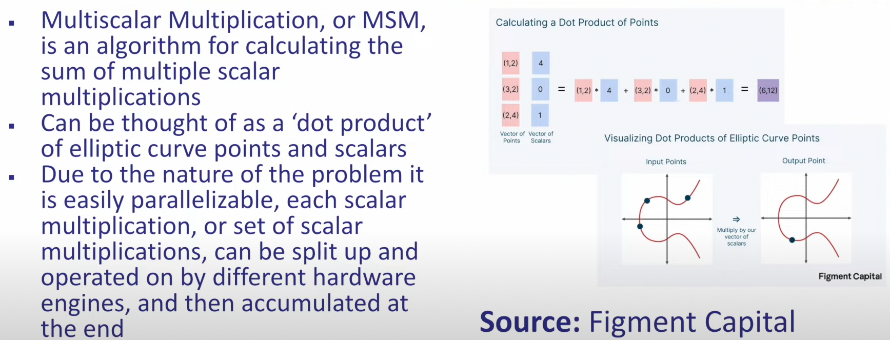

MSM 是一种用于计算多个标量乘法之和的算法，或者它可以被认为是椭圆曲线点和标量的点积。

由于问题的性质，每个标量乘法或一组标量乘法都可以很容易地并行化，并且可以由不同的硬件引擎拆分和操作然后汇集并在最后累积，有许多优化可用于减少计算 MSM 的计算量，用于更大尺寸的 MSM 算法，如pipepenger。

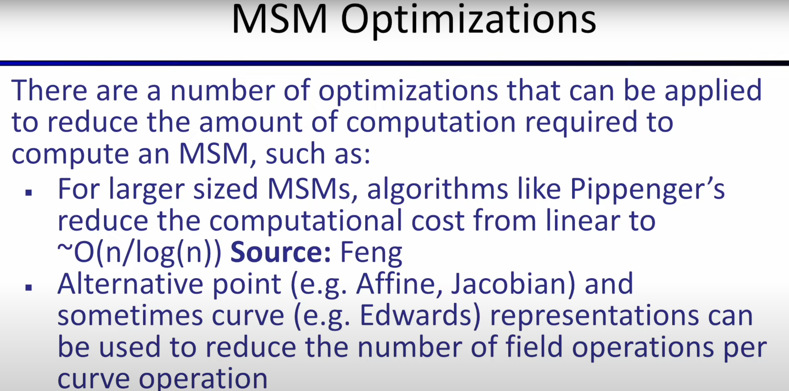pippengers，将计算成本从线性减少到O(n/logn)，除了使用改进的算法之外，
还有替代的点表示方法（**Jacobian**）和曲线表示方法（**Edwards**)可用于减少每个曲线上的域元素的操作总数

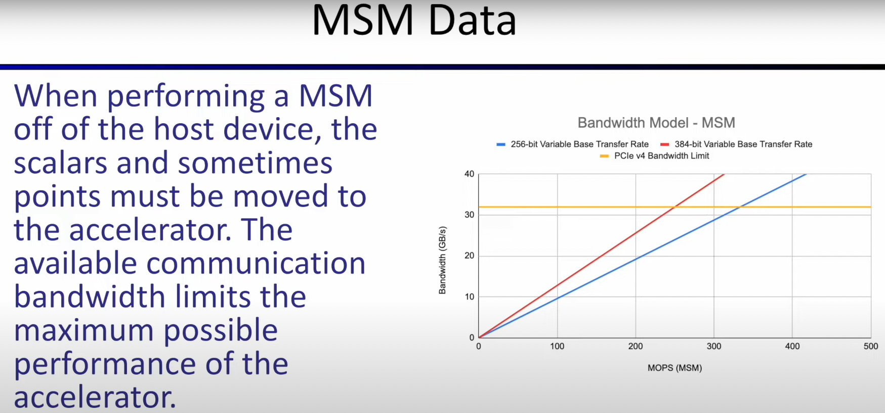通过将它们从像 CPU 这样的主机设备转移到更并行的架构，如 GPU，可以提高计算效率。然而，当将操作从主机设备移动到外围设备时，必须记住一件事情，即数据也必须被移动以进行计算。在多标量乘法的情况下，标量和点必须从主机移动到加速器上进行计算。这两个设备之间可用的通信带宽通常会限制加速器的最大性能。

### 4.NTT

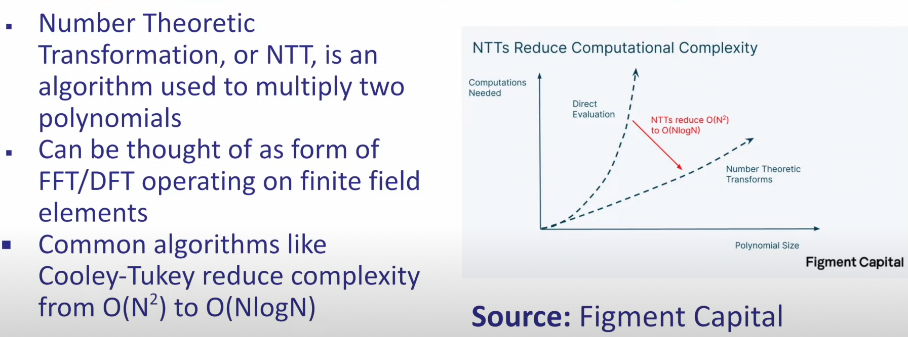

NTT 是一种用于将两个多项式相乘的算法
NTT 类似于其他算法，例如 fft 或 DFT，但它的独特之处在于`它对有限域元素进行运算`。

实现 NTT 的常用算法之一是Cooley-Tukey算法，该算法将多项式乘法的复杂性从O（n^2）降低到O（nlog n）阶

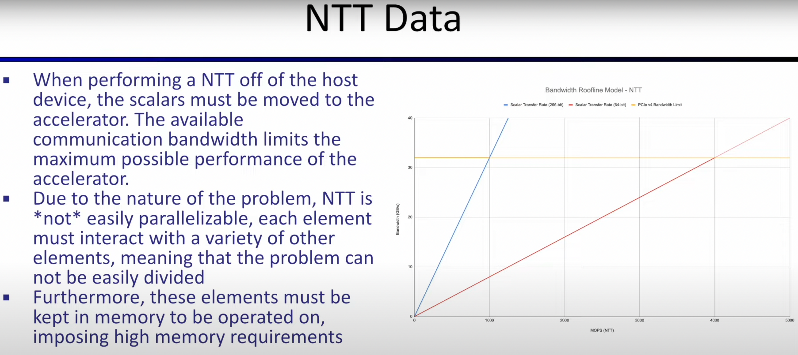
类似于 MSM 在主机设备上执行 NTT 时，标量也必须再次移至加速器 通信带宽将限制加速器的最大可能性能，但是 `NTT不容易并行化`。
每个元素必须在算法操作期间与各种其他元素交互，这意味着问题不能轻易进一步划分，因为这些元素与每个元素交互，它们必须保存在内存中并在强加`高内存要求`的情况下运行

### 5.算术hash

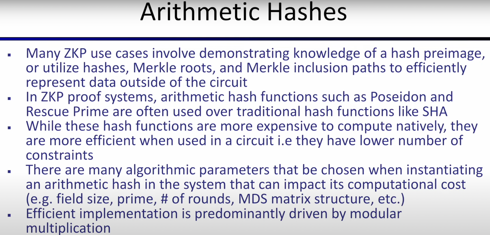

许多零知识证明用例中的算术哈希它要求

证明哈希原像的知识或利用哈希 ，Merkle  roots和 Merkel 包含路径有效地表示电路外部的数据。
算术哈希函数（如 Poseidon，rescue Prime）通常用于传统散列函数（如 `ShA系列`哈希函数）。

选择这些哈希函数是因为虽然本身它们的计算成本更高，`但在电路内部使用时，部署效率会更高`，因为这些哈希函数的constraints数量会更少。
在实例化哈希函数时可以选择许多算法参数，这可能会影响计算成本。其中一些参数包括`有限域大小，有限域选择的素数大小，MDS 矩阵结构`等。

算术哈希原语的有效实现主要由`模乘法`驱动，证明生成中涉及的计算量大的操作通常`因系统而异`。

这些操作取决于承诺方案，像`KZG`这样的承诺方案会导致在生成证明过程中 MSM 操作会主导。

而当使用`FRI`承诺方案时，证明生成过程通常由 NTT 主导。

许多 snark 系统，例如groth16 和 Marlin由 MSM 主导，而 Starks 总体上通常由 NTT 主导。

但是这三个先前讨论的密码原语（MSM，NTT，算术哈希）在加速之前在所有证明系统中占据了三分之二或更多的时间
这三个操作可能看起来截然不同，但它们实际上共享一些基础组件。

比如MSM and NTT的公共基础组件是域和曲线操作，这些操作的核心主要由域上的算术驱动，特别是`模乘法`

因此虽然这些算法的结构彼此，大不相同，但它们是`基础的性能通常源自硬件执行模乘法的能力` 

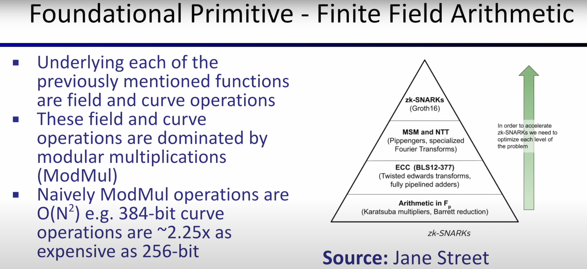

> 需要注意的一件有趣的事情是数据大小与模乘法计算成本之间的关系，
> 当数据大小呈线性增长,模乘法的计算成本相对于域的大小是N^2。
>
> 这意味着随着域大小的增长，加速器性能可能取决于操作的计算成本，
> 但对于较小的域大小，加速器可能会受到主机可用带宽的瓶颈

这种二分法凸显了在开始设计硬件加速系统时理解证明系统的具体参数的重要性。

它也凸显了设计能够服务于各种证明系统和参数的硬件加速设备或实现的难度。

### 6.提高证明生成性能

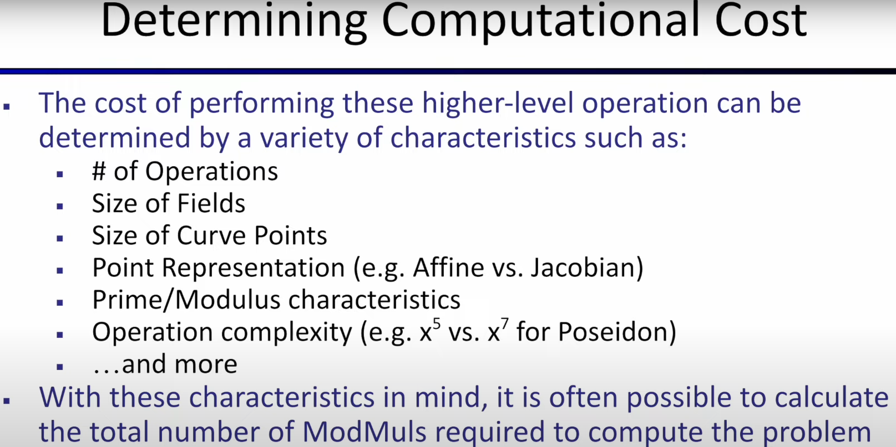

改善证明生成性能的第一步是了解所使用的证明系统和用例的计算、内存和带宽成本，通过将高级操作（如 MSM 和 NTT）分解为计算它们所需的模乘数量。通常可以在完成实现之前估算证明系统在各种硬件平台上的性能。

然而，为了确保估计是准确的，有许多参数应该提前知道

`第一个最重要的参数`是证明系统中每个操作的数量，
例如一些证明 系统每个证明可能需要四个或更多 msms
而其他系统可能只需要两个

`第二个关键因素`是通常需要计算的操作的大小，不同的用例将导致每个操作的不同大小
例如在某些用例中 MSM将只有 1000 的大小，而在另一个用例中，它可能是 1000 万或更多

`第三个因素`是确定的是域和曲线的大小，这将有助于告知每个模块化算术运算的带宽和计算复杂性

`此外`，点的表述形式（Affine or Jacobian），模运算等等
`最后`还有各种其他较小的因素可能有助于证明系统的性能
一旦所有这些参数都确定了，执行证明或证明生成过程所需的模乘次数可以很容易地计算出来，有了这个数字，就可以 
与给定硬件平台的模型性能进行比较，以便在了解需要执行的计算的情况下得出性能估计或计算时间

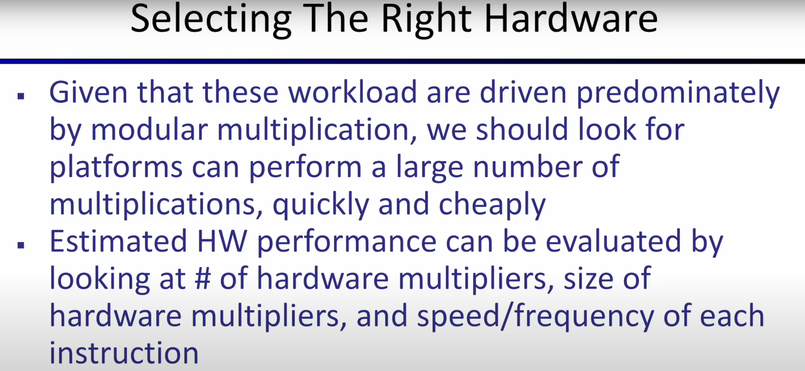
硬件加速的下一步是为这些工作负载选择合适的硬件-主要由模乘法驱动

应该寻找可以快速且廉价地执行大量乘法的硬件平台

可通过查看平台上硬件乘法器以及每个乘法器可以执行的速度和频率来评估给定硬件平台的估计性能

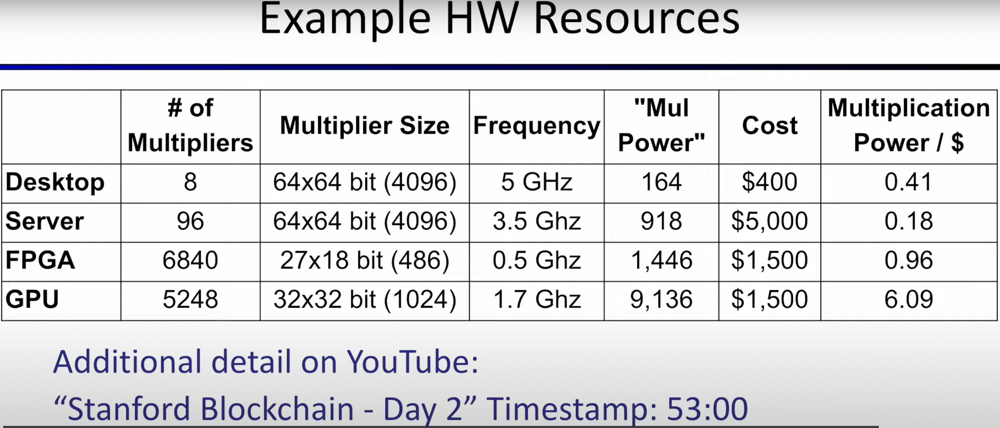

上图是一个包含四个硬件平台的表格：桌面CPU、服务器 CPU、FPGA 和 GPU

- 第一个平台：桌面 CPU
  - 包含八个内核，每个内核都有一个 64 x 64 位乘法器，工作频率为 5GHz
  - 此平台的乘法功率估计约为164 该数字的计算方法是将乘法器的数量、乘法器大小和频率相乘，然后除以 1000
- 第二个平台：服务器 CPU 
  - 包含96 个内核，每个内核都有一个Multiplier，但以较低的频率运行，这个平台有大约 900 的Multi能力。是桌面处理器的五倍
- 第三个平台：FPGA
  - 与服务器上存在的 96 个相比，超过 6000个乘法器。虽然乘法器数量大约是服务器CPU乘法器数量的 60 倍，但由于乘法器大小和频率的减少，乘法运算的功率小于服务器 CPU 的两倍。
- 第四个平台：GPU
  - 大约5000个32*32位的乘法器，以 1.7 GHz 的频率运行，这产生了大约 9000乘法能力
  - 相较于FPGA，拥有更大的乘法器大小和更高的工作频率，性能得到提高

> 关于这些底层硬件架构及其对模块性能的影响，强烈推荐Simon puffer 几年前在斯坦福区块链会议上的演讲，它可以在 YouTube 上找到 

这些分析仅突出硬件平台的基础功能，

为了实现提高性能并达到硬件加速的目标，通常还必须考虑其他因素。

包括实现理论性能的能力、部署的便利性、运营成本、esa编程和许多其他因素

成功的硬件加速需要关注的两个关键领域

首先是选择适合目标平台的硬件友好算法

针对 GPU 和 FPGA 这样的目标平台具有数千个核心，最适合使用高度可并行化的算法。此外，在选择算法时，应选择旨在通过减少所需操作数量来降低总计算成本的算法。

一旦选择了算法，最后一步是创建高效的实现。通常情况下，需要重新构造算法以更好地匹配目标平台的硬件能力。除了重构算法外，通常还需要使用低级汇编原语来更充分地利用硬件资源并实现最大的性能。

### 7.硬件加速存在的限制与陷阱

在追求硬件加速时，乘法不是唯一需要的资源。虽然这些高级原语主要由模数乘法组成，但算术单元中的其他计算资源通常也是必需的。此外，根据正在加速的操作的大小和类型，非计算资源也可能成为瓶颈。例如，像 `NTT 这样的操作有时会受到内存访问速度的瓶颈限制。`

另外，对于问题规模较大的用例，有时所需数据无法全部 在目标平台的内存中容纳，从而导致性能降低。对于连接到主机系统的加速器，通信带宽也可能成为瓶颈。目前，许多 GPU 和 FPGA 硬件加速的 `NTT 实现受限于它们在主机和加速器之间传输数据的能力，而不是计算资源`。有时可以通过将数据保留在加速器上来减少带宽需求，从而缓解或消除这些瓶颈。

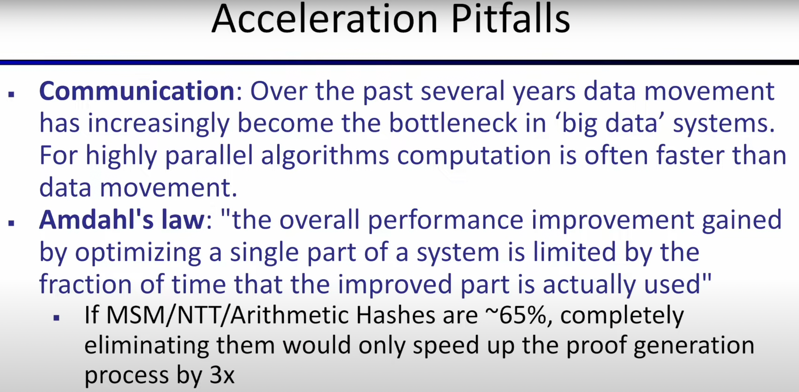

> 数据移动成为瓶颈而不是数据计算不仅在 NTT 和 ZKP 系统中出现，而且在大数据和高性能计算环境中普遍存在这种趋势。`对于高度并行的算法，计算速度往往比数据移动本身更快，因此硬件加速设计应尽量减少数据移动。`

在使用主机外加速器时，另一个需要考虑的因素是将数据移动到加速器和返回主机的时间。

对于小问题，有时在主机上直接进行计算可能比在加速器上更高效。

> 硬件加速的`最后一个陷阱`是广为人知的奥姆德尔定律或贝尔定律，它指出，通过优化系统的单个部分或单个部分获得的总体性能提高取决于改进部分实际使用的时间占总时间的比例。

更简单地说，在 ZKP 系统中，如果 MSM、NTT 和算术哈希占据大约 65% 的时间，即使这些操作被消除，最大的加速比也只能达到 3 倍。考虑到证明生成与本地计算的时间开销相差几十万到一百万倍，显然优化工作不会止步于此。

### 8.FileCoin的加速例子

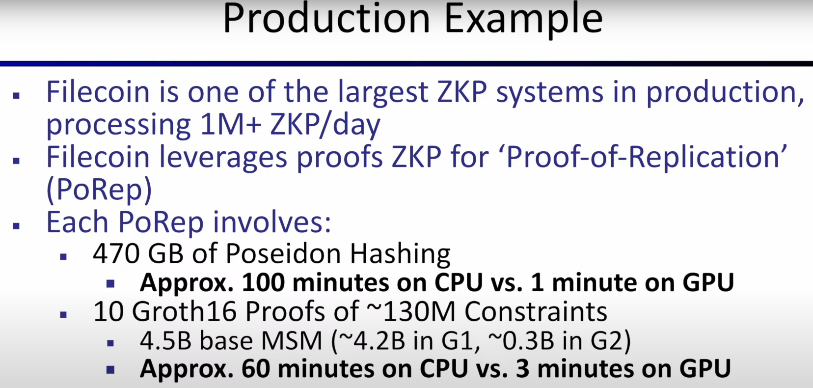

过去几年，Filecoin 一直是最大的 ZKP 系统之一，每天平均生成 1 到 5 百万个证明。

Filecoin 使用 ZKPS 来进行副本证明 (PRORAP)，这是一种证明你已经创建了数据集的唯一副本的加密方式。Filecoin 中使用的副本证明需要大约 `470 GB` 的 Poseidon 哈希。

如果在许多核心的 CPU 系统上进行哈希运算，需要大约 100 分钟。

相比之下，Filecoin 的 GPU 实现仅需要大约一分钟，可以实现大约 100 倍的性能提升。

对于 Filecoin 中的密码学证明组件，他们利用了 Groth16 协议。在 Filecoin 网络上进行每个 PoRep 时，存储提供者会生成 10 个证明，每个证明大约有 `1.3 亿个约束条件`，总共超过 10 亿个约束条件。仅用于创建这些证明的 MSM 就总计约为 `45 亿个点标量对`。

如果这些证明在许多核心的 CPU 上计算，需要约一个小时才能完成。相比之下，在 GPU 上可以在大约三分钟内完成，这是一个大约 20 倍的性能提升。这个例子突显了硬件加速让ZKP 用例变得实际可行的能力。

### 9.zk加速的现在与未来

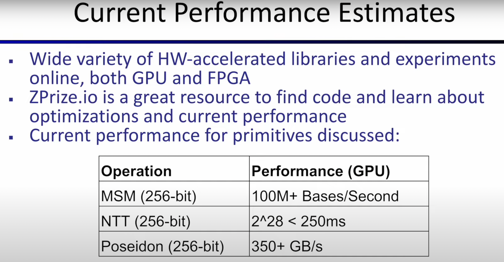

了解更多关于硬件加速的知识，有许多在线资源可用，包括许多今天讨论的加密原语的开源 GPU 和 FPGA 实现。

一个特别好的资源是 zprize.io，这是一个旨在改善 ZKP 系统性能的社区倡议。

对用于更大的多标量乘法，单个 GPU 可以以每秒超过 1 亿个Bases的速度执行，
就 NTT 而言，大小为 2 到28 的 NTT 可以在 250 毫秒内计算出来，
对于 Poseidon 哈希，GPU 可以大约哈希 每秒 350 GB。

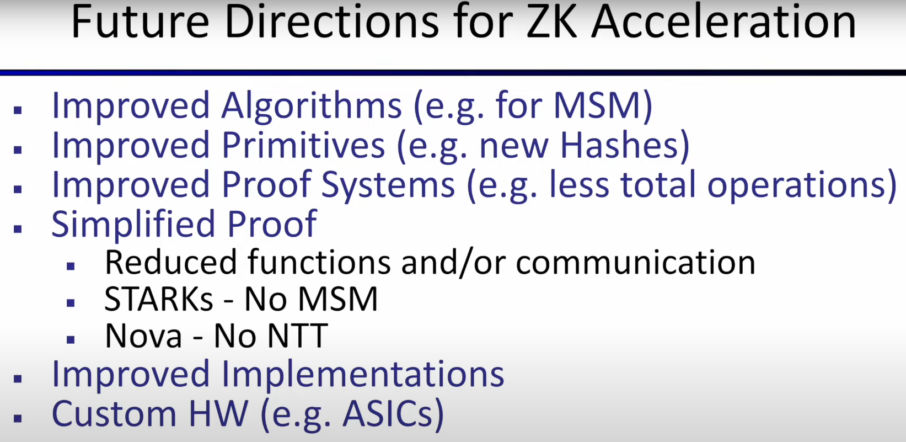

尽管在过去几年中，ZKP 硬件加速取得了巨大进展，但仍有很大的改进空间。下面是一些可以帮助证明生成更快的领域。

`第一个领域`是针对核心原语（如 MSM 和 NTT）的改进算法或对现有算法的其他优化。

`第二个领域`是全新的核心原语，如具有更低计算要求的新哈希函数。

`第三个领域`即新的证明系统，特别是关于硬件加速的简化证明系统。简化的证明系统可以为硬件加速创造更多机会。

例如，更简化的证明系统可以减少不同操作、减少通信和内存要求，甚至消除一些目前存在的计算昂贵的操作。最后，改进实现的空间也永远存在，包括完整的证明系统和硬件加速的原语。这包括针对商用 GPU 和 FPGA 等现成硬件以及定制硅片（例如 ASIC）的设计。

Reference

[Amber Group.“Need for Speed: Zero Knowledge.Introduction I by Amber Group](https:/medium.com/amber-group/need-for-speed-zero-knowledge-1e29d4a82fcd)

[Feng, Boyuan. "Multi-scalar Multiplication (MSM) .](https:/hackmd.io/@tazAymRSQCGXTUKkbh1BAg/Sk27liTW9) 

[Figment Capital.“Accelerating Zero-Knowledge Proofs.](https://figmentcapital.medium.com/accelerating-zero-knowledge-proofs-cfc806de611b.)

[Jane Street. "Accelerating zk-SNARKs - MSM and NTT alorithms on FPGAs with Hardcaml." Jane Street Tech Blog, 7 December 2022](https://blog.janestreet.com/zero-knowledge-fpgas-hardcaml/).

[Thaler, Justin. "Measuring SNARK performance: Frontends, backends, and the future." a16z crypto, 11 August 2022](https:/a16zcrypto.com/content/article/measuring-snark-performance-frontends-backends-and-the-future/.)

[Zhang, Ye. "ZKP MOOC Lecture 12: zkEVM Design, Optimization and Applications.](https://www.youtube.com/watch?v=vuQGdbpDWcs&ab_channel=Blockchain-Web3MOOCs.)
