# Introduction to Zero knowledge Interactive Proofs

# NP

## NP Proof:

NP-proofs 属于可高效验证的 proofs.其中要求

1.Witness 的长度应当是 statement x 的长度的多项式表示.

2.Verifier 时间是 x 长度的多项式函数表示

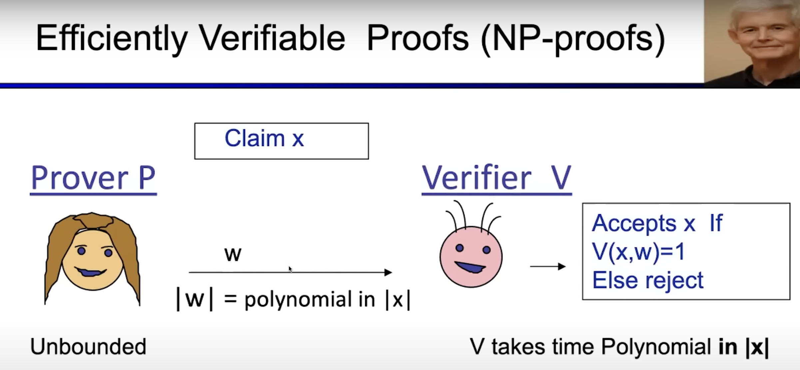

## NP proofs 例子

上述例子都可以用一种通用的语言关系 L 来表示

更具体而言,上述都是 NP 问题:(简单来说,求解困难,但是验证高效的问题)

> - P NP  NPC
>   - P 问题：指能在多项式时间求解出的问题.如 2SAT,欧拉路径,PATH 问题
>   - NP:Nondeterministic polynominal(非确定性多项式)
>   一个问题不能确定是否能够在多项式时间内找到一个解。但若给出一个解，能在多项式时间内证明这个解是否正确 .如果找到一个解，那么 NP 问题就变成了 P 问题，所以 P∈NP 类  注：NP 问题不能理解为非 P 问题
>   著名的 NP 类问题：旅行家推销问题(TSP)。即有一个推销员，要到 n 个城市推销商品，他要找出一个包含所有 n 个城市的环路，这个环路路径小于 a。如果单纯的用枚举法来列举的话会有(n-1)! 种，已经不是多项式时间的算法了，阶乘比多项式复杂。假设有人猜几次就猜中了一条小于长度 a 的路径，TSP 问题解决了。可是，人们不可能每次都猜的那么准。所以说，这是一个 NP 类问题。也就是，我们能在多项式的时间内验证并得出问题的正确解，可是我们却不知道（非不存在）该问题是否存在一个多项式时间的算法能解决。
>   **NP问题的本质是单向性，不可快速求解，但是能够快速验证**。
>   - NPC：
>   规约：问题 A 可以转化为问题 B，对于难度而言，问题 B 比问题 A 要困难。规约具有传递性：A 规约至 B，B 规约至 C，那么 A 规约至 C。一直规约下便会得到 NPC 问题
>   所有的 NP 问题都可以约化成 NPC 问题。只要解决了这个问题，那么所有的 NP 问题都解决了。NPC 需要满足两个条件.
>     1. 是一个 NP 问题 
>     2. 所有的 NP 问题都可以约化到它。如 SAT 问题、HAMPATH 问题都属于 NPC 问题.
>   - NP-hard 问题
>   它满足 NPC 问题定义的第二条但不一定要满足第一条（就是说，NP-Hard 问题要比 NPC 问题的范围广，NP-Hard 问题没有限定属于 NP），即所有的 NP 问题都能约化到它，但是它不一定是一个 NP 问题
>   - P NP NPC NP-hard 关系
>   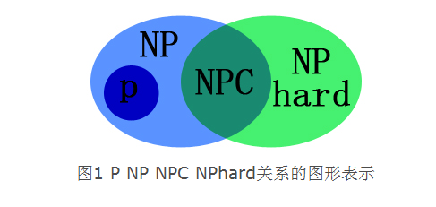
## NP Language 定义:

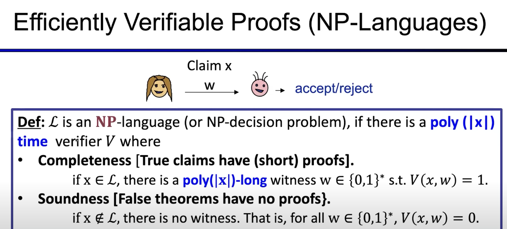

给定二元关系$R:\{0,1\}^∗ ×\{0,1\}^∗ →{0,1}$,记语言 L(R)为集合$\{x:∃w \ s.t.\ R(x,w)=1\}$.称一 个语言 L(R) 是 NP 语言当如下两个条件成立:

- $|w|=poly(|x|)$

- 给定任意的 x、w, 存在多项式时间算法能够高效判定 R(x, w) =? 1

**注:此时还与零知识无关**

考虑有没有其他方式,比如在大素数分解 N=PQ 中,不暴露 P 或 Q 的值让验证者相信这些类型的定理

# ZKP

引入**交互**与**随机**

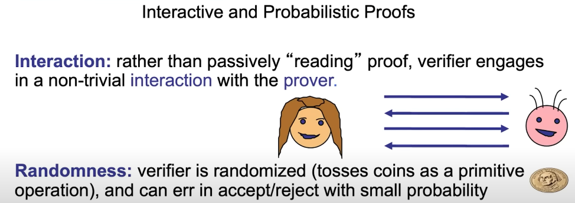

**交互**

验证者不再被动地阅读证明，相反验证者会与证明者进行重要的交互。

Prover 与 Verifier 之间进行**多项式步骤的交互**

**随机**

Verifier 不再是一个**确定性**的算法

Verifier 的问题通过抛硬币的方式,即问题在某种程度上是不可预测的

随机性的本质是接受小概率的错误,但这种概率应当被量化,比如小于某一个可忽略函数.

## 例子

参考[郭宇老师的初识「零知识」与「证明」—— 探索零知识证明系列（一)](https://zhuanlan.zhihu.com/p/75936137):地图三染色问题

## Definitions of Zeroknowledge interactive Proof

### 1.Interactive Proof system for a Language L

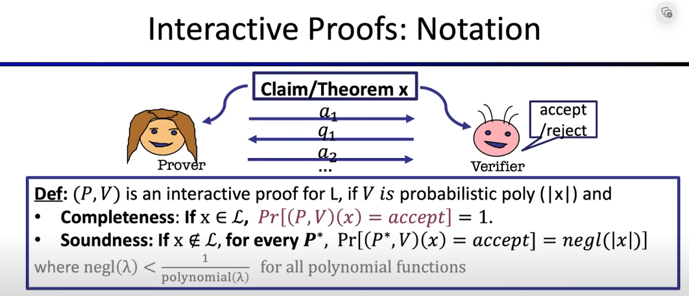

可忽略函数:一个比任何多项式函数分之一增长都慢的函数

## Zero knowledge

谈论零知识前,需要引入**模拟器**的概念.

这里参考[郭宇老师--从「模拟」理解零知识证明：平行宇宙与时光倒流---探索零知识证明系列（二）](https://zhuanlan.zhihu.com/p/76849956),而不使用课程的例子.

### 模拟器:Simulator

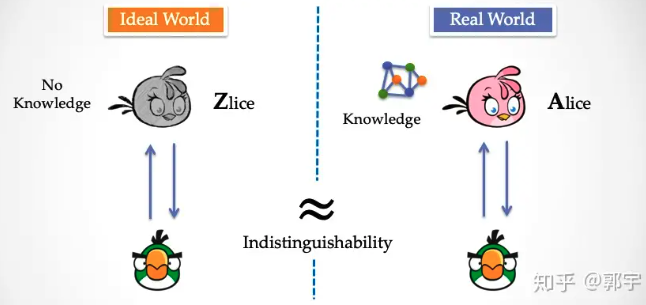

简单来说

**现实世界/视图**:是一个概率分布.这个空间中的点都是证明者和验证者之间交互的所有可能历史加上验证者的硬币投掷。

**理想世界/视图**:也是一个概率分布.`但理想世界/视图需要是算法可构造的`,由 Simulator 负责构造.

理想世界/视图与现实世界/视图的**差异**在于:理想世界/视图没有知识,现实世界/视图拥有知识.

对于一个多项式时间的**区分器**，它从上述分布中选择一个样本.如果区分器不能区分这个样本来自哪个分布,即来自哪个世界/视图,我们说这样的交互协议是零知识的.

**因为理想世界/视图中的 Zlice 是没有任何知识，而且她和真实世界/视图中的 Alice 不可区分.**

或者说区分成功的概率不大于 0.5.那么这两个分布在计算上是无法区分的。

> Simulator 是怎么做到这一点的?
> Simulator 能够而是因为它可以"倒序"生成 `视图/世界`,即 Simulator 可以先随机选择一个挑战，然后基于这个挑战生成证明的一部分。这样生成的视图在统计上与真实的视图无法区分。
### 计算不可区分定义:

这里给出更一般的计算不可区分定义

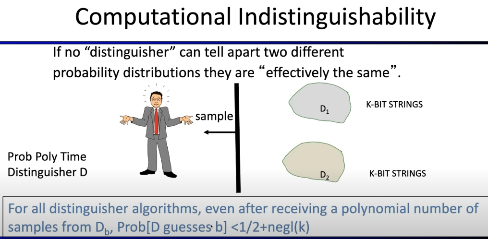

这里的**安全参数 k** 表示**某个计算困难问题的困难问题实例输入大小**。每个困难问题都有一个界，当输入大小超过这个界时，我们就认为这个问题是计算困难的。--具体可参考[刘巍然老师的回答](https://www.zhihu.com/question/48949270)

### Zero Knowledge Define:

### Flavor of Zero Knowledge

零知识分类

这里不给出形式化定义,简单来说即

两个随机变量的分布是计算不可区分的，也就是任何多项式时间的随机敌手都无法区分这两个分布，就称这个证明系统是**计算零知识 (Computationally Zero-Knowledge)**

两个随机变量的分布是统计不可区分的，也就是它们的统计距离 (Statistical Distance) 可忽略，就称这个证明系统是**统计零知识 (Statistically Zero-Knowledge)** 的；

如果统计距离就是 0，又叫做**完美零知识 (Perfect Zero-Knowledge)** 的；

## Proof of Knowledge

一个 Proof System 是 POK 的,需满足以下定义

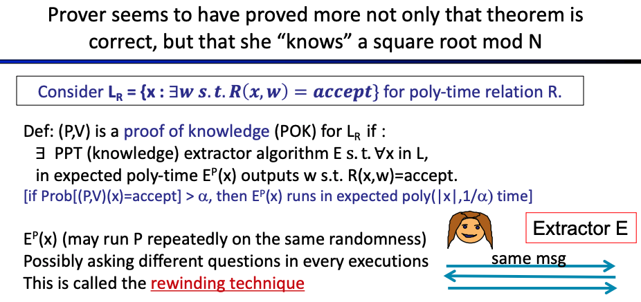

`需要引入抽取器,抽取器具有时光回溯的能力.`

抽取器 在理想世界中，通过时间倒流的超能力，把 Prover 的知识完整地抽取出来

> 注:抽取器可以提取出 witness，不是因为它具有**无限的计算能力**,而是因为它能与证明者进行多次交互。在每一轮的交互中，抽取器都会选择一个新的挑战，然后记录下 Prover 的回应。
这就保证了一个没有知识的 Prover 是无法让抽取器达成目标，从而证明了可靠性。

> 抽取器只能从能成功完成证明的证明者那里提取出（witness）。如果一个 Prover 不能成功完成证明，那么他可能并不知道一个有效的 witness，因此抽取器无法从 Prover 那提取出 witness。
把这样一个依靠采用抽取器来证明可靠性的证明系统被称为 **Proof of Knowledge**

> 注:不是所有的可靠性都必须要求存在抽取器算法
这里可参考[郭宇老师:探索零知识证明系列（三）:寻找知识](https://github.com/sec-bit/learning-zkp/blob/master/zkp-intro/3/zkp-pok.md)

### The First Application:Identity Theft

Alice 想通过互联网证明向 Bob 证明其就是 Alice,比如 Bob 是亚马逊的.

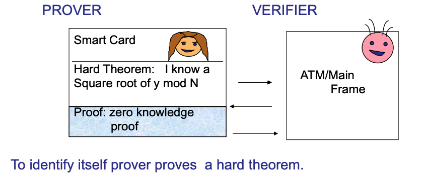

思想是:将证明 Alice 的身份转为 Alice 证明一道特定的难题,谁知道这个难题的答案谁就是 Alice.

## NP and Zero Knowledge Interactive Proof

结论:如果[单向函数](https://en.wikipedia.org/wiki/One-way_function)(简单来说 is easy to compute on every input, but hard to [invert](https://en.wikipedia.org/wiki/Inverse_function) given the [image](https://en.wikipedia.org/wiki/Image_(mathematics)) of a random input,具体参考 wiki)存在,那么每种 NP 语言都具有零知识交互证明。

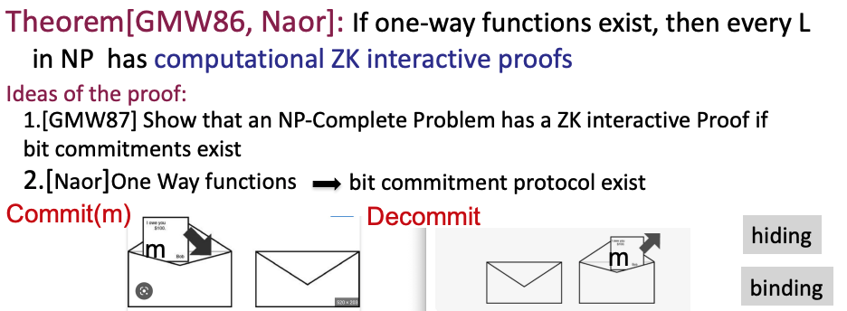

先引入承诺的概念

### 承诺

#### 承诺性质

- **Hiding:意味着敌手获得承诺 c(m)后无法获得 m 的值**

  - computational hiding:对于任意的 PPT 敌手 A.有
    
  - Perfect hiding:将 A 的计算能力修改为无穷算力,“≤ negl(λ)”替换为 0
- **Binding:是指一个承诺 c(m) 在 Open 阶段打开只会为一个值 m 而不会得到 m‘.**

  - computational  Binding
    
  - perfect binding::将 A 的计算能力修改为无穷算力,“≤ negl(λ)”替换为 0

### 举例:地图三染色问题

地图的三染色问题是一个 NP 完全问题,即 NPC 问题.

**生动易懂的例子**仍然可以参考[郭宇老师的初识「零知识」与「证明」—— 探索零知识证明系列（一)](https://zhuanlan.zhihu.com/p/75936137):

过程总结如下:

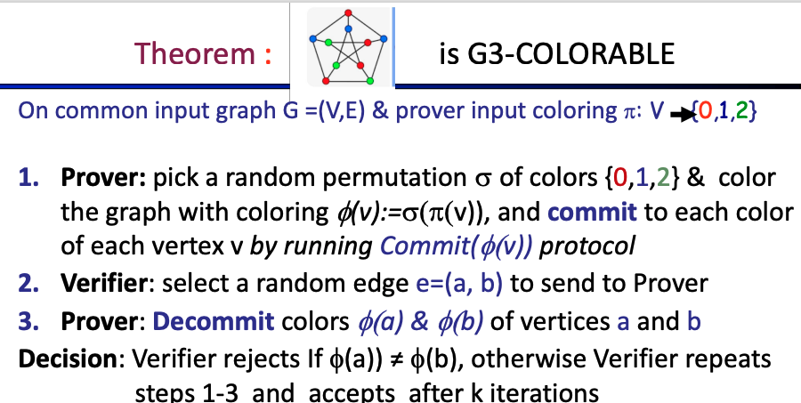

性质如下

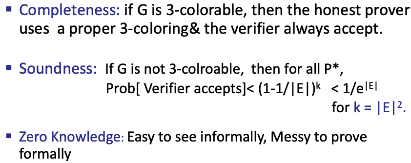

**完整性**:一个诚实的 P 总是可以说服验证者接受。因为无论 Vr 需要哪条边，P 总是可以正确地给出符合规则的上色方案。 总是接受

**健全性**:无论 恶意的P做什么，都会有一条边缘的颜色不正确。当 V 选择随机边时，实际上选中错误的概率是 1/E,成功骗过 P 的概率是(1-1/E).随着重复的次数增多,成功的概率变为$(1-1/E)^k$,呈指数级降低。概率接受

**零知识性:**很容易能够看出来,整个过程验证者得到了很多信息,但是这些信息并不会帮助验证者获取地图三染色问题答案的**知识**.但形式化证明很麻烦。

> `模拟器` 不知道染色答案,它可以提前确定诚实 V 会询问的边 E‘
> `模拟器` 可以将整个图都涂成一样的颜色,除了 E’的两端 a,b 会被涂成两种不同的颜色.
> 对于**模拟世界/视图**:它会输出一堆承诺,由于承诺的性质,这些承诺不会给**计算能力有限**的 `区分器` 提供任何信息.然后 `区分器` 随机选择一条边 E,由于模拟器能够提前知道区分器随机选择哪条边.所以 E=E‘. 打开 E/E‘的承诺以后,V 会发现 a,b 是不同的颜色.`模拟器` 成功完成该轮挑战
> 但实际上,`模拟器` 并不知道染色答案,但是 V 每次打开 E 的承诺,对应的 a,b 端点颜色又确实是不一样的.所以**真实世界/视图**与**模拟世界/视图**在计算上是无法区分的.
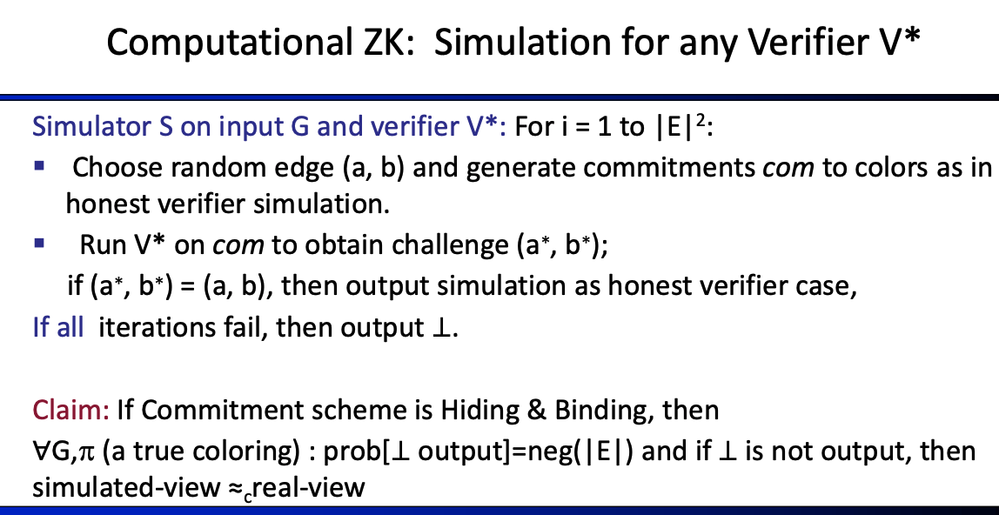

## zk 的应用

法律 隐私 生物 DNA 甚至是核裁军

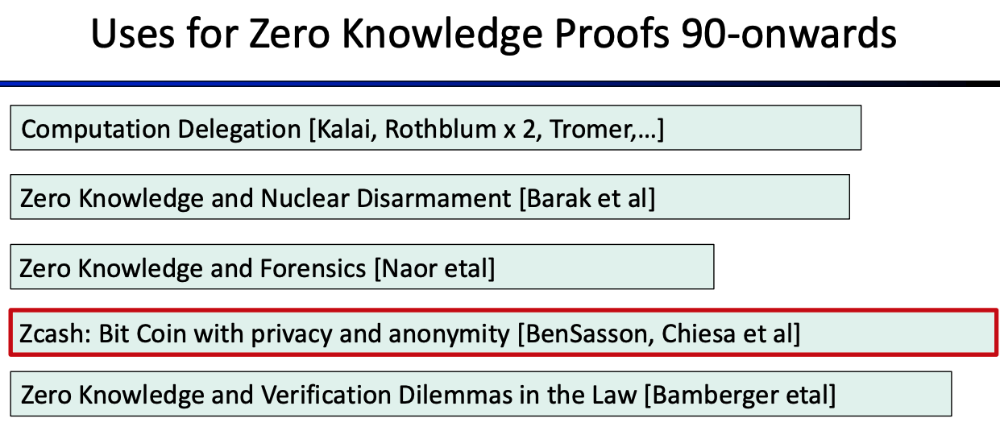

# 复杂性理论(Complexity Theory)

## Interactive Proof

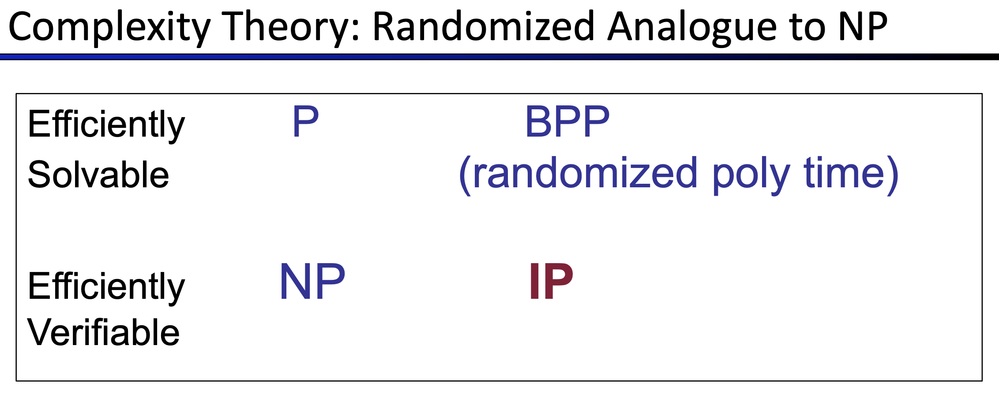

- BPP:复杂类 BPP 在多项式时间内对概率图灵机解出的问题的集合, 并且对所有的输入，输出结果有错误的概率在 1/3 之内
  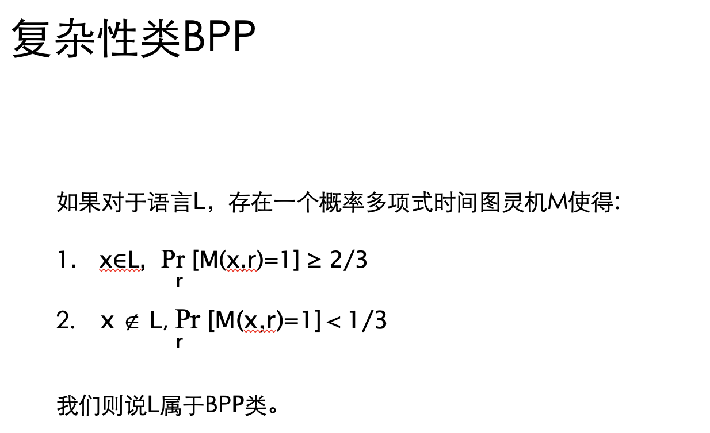
- IP:交互式证明

  - 是一种包含了两个参与者（证明者和验证者）的验证系统，其中证明者试图通过多轮对话来说服验证者某个复杂陈述的真实性。
  - 定义
    - 设⟨A, B⟩ 为一对交互式图灵机. 记 ⟨A(y), B(z)⟩(x) 为在 A、B 的随机输入带均匀独立选取, 公共输入为 x, A 的辅助输入为 y, B 的辅助输入为 z 时, 图灵机 B 与图灵机 A 交互后输出的随机变量.
    - 给定二元关系 R 及其对应语言 L(R), 则针对该语言的 IPS(interactive proof systems)是用符号⟨P(y),V(z)⟩表示 .其中,图灵机 P 与 P*可以是无穷算力 V 是 PPT 的.则 IPS 满足两个性质
      - 完备性 (completeness): 对于任意的 x ∈ L(R), 存在 y, 使得对于任意的 $z ∈\{0, 1\}^∗, Pr[⟨P(y), V(z)⟩(x) = 1] ≥ 1 − negl(|x|)$. 完美完备性 (perfect completeness) 是指上述概率等 于 1.
      - 可靠性 (soundness): 对于任意的 x ∈/ L(R), 任意的恶意证明者 P*, 任意的$y, z ∈ \{0, 1\}^∗, 有 Pr[⟨P^*(y), V(z)⟩(x) = 1] ≤ negl(|x|)$.
- IP 与 NP 的关系

  - IP 类可以看作是经典复杂类 NP 的**交互式随机**变体,所有的 NP 问题也都可以在 IP 中找到解决方案，因此 IP 是 NP 的超集。

  - 在 IP 系统中，Prover 和 Verifier 之间有多轮的交互，而在 NP 问题中，证明（或解决方案）一旦生成，就可以独立地被验证，不需要进一步的交互。如果不允许交互，但允许验证者抛掷随机硬币并以小概率接受错误的证明，那么得到的复杂性类被称为 [Merlin-Arthur(MA)](https://www.cs.cornell.edu/courses/cs6810/2009sp/scribe/lecture17.pdf)

  > 这再次说明了 IP 强大的关键在于**随机性**和**交互**的结合
  >
  - **Prover** 在 IP 中并没有时间复杂度的限制，可以是全知的，这意味着它可能运行在超出概率多项式时间的时间复杂度。它能够进行**任意复杂的计算**来构建它的证明，只要这个证明能够在多项式时间内被验证
  - **Verifier** 在 IP 中必须运行在**概率多项式时间**（probabilistic polynomial time）内，即必须在多项式时间内完成计算

## Private Coins Model

## Interactive Proofs with Public Coins Model

“We can formulate a decision problem under uncertainty as a new sort of game, in which one opponent is ‘disinterested’ and plays at random, while the other tries to pick a strategy which maximizes the probability of winning – a ‘game against Nature’.” **---Christos Papadimitriou**. Games Against Nature. FOCS 1983.

如果不允许交互，但允许验证者抛掷随机硬币并以小概率接受错误的证明，那么得到的复杂性类被称为 [Merlin-Arthur(MA)](https://www.cs.cornell.edu/courses/cs6810/2009sp/scribe/lecture17.pdf)

### AM 与 MA

- Arthur-Merlin Protocol

协议中的两个参与者分别称为 Arthur 和 Merlin，基本假设是 Arthur 是配备随机数生成设备的标准计算机（或验证器），而 Merlin 实际上是具有无限计算能力的预言机（也称为证明者）。不过，Merlin 不一定是诚实的，所以亚瑟必须分析 Merlin 在回答亚瑟的询问时提供的信息，并自行决定问题。如果在这个协议中，每当答案是“是”时，Merlin 有一系列的回应，会导致 Arthur 在至少 2/3 的情况下接受，那么问题被认为是可以通过这个协议解决的。而如果答案是“否”，那么 Arthur 永远不会在超过 1/3 的情况下接受。

- MA

1-message protocol

Merlin 向 Arthur 发送消息，然后 Arthur 通过运行概率多项式时间计算来决定是否接受。（这类似于基于验证器的 NP 定义，唯一的区别是 Arthur 在这里被允许使用随机性。Merlin 在这个协议中无法访问 Arthur 的硬币抛掷，因为它是一个单消息协议，Arthur 只有在收到 Merlin 的信息后才会抛硬币。

从形式上讲如果存在多项式时间确定性图灵机 M 和多项式 p，q 使得对于长度 n = |x| 的每个输入字符串 x，

- AM

复杂度类 AM（或 AM[**2**]或 AM[**K**]）可以通过具有**两条/K 条**消息的 Arthur-Merlin 协议在多项式时间内决定。只有 **1/2/K 个查询/响应对**：Arthur 随机抛出一些硬币并将他所有抛硬币的结果发送给 Merlin，Merlin 用所谓的证明做出回应，Arthur 确定性地验证证明。

在这个协议中，Arthur 只被允许将抛硬币的结果发送给 Merlin，在最后阶段，Arthur 必须只使用他之前生成的随机抛硬币和 Merlin 的信息来决定是接受还是拒绝

从形式上讲如果存在多项式时间确定性图灵机 M 和多项式 p，q 使得对于长度 n = |x| 的每个输入字符串 x

简单总结:

> 摘自啊咪咪小熊---
> MA 就是最简单的 M 给 A 发完就结束了，A 自己决定是否接受，就是非交互式的（和 NP 的区别就是 Verifier 可以用随机数）。
> AM 就是 A 先给 M 发一个随机数，然后 M 再给 A 回复，然后 A 再决定是否接受，就是交互式的
## IP = PSPACE 定理

任何可以在多项式**空间**内解决的问题都可以通过交互式证明的方式来解决。

具体可参照[这](https://en.wikipedia.org/wiki/IP_(complexity)),这个假设的重要性在于它将两个看似不同的计算模型联系在了一起.

其中 PSPACE 简单理解为是比 NP 要大得多的语言类

## MIP

MIP 类似于 IP，只是有多个证明者，并且假设这些证明者不会相互共享关于他们从验证者那里收到什么挑战的信息。MIP 的一个比喻是在审讯犯罪嫌疑人之前将多个犯罪嫌疑人放在不同的房间里，看看他们是否能保持他们的故事直截了当。对 MIP 的研究表明，如果一个人将证明者锁在不同的房间里，然后分别审问他们，他们可以说服审问者做出比一起接受审问要复杂得多的陈述。

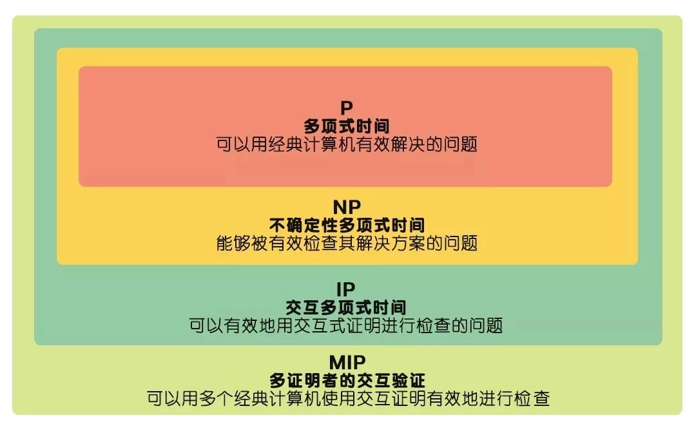

## Non Interactive Proof

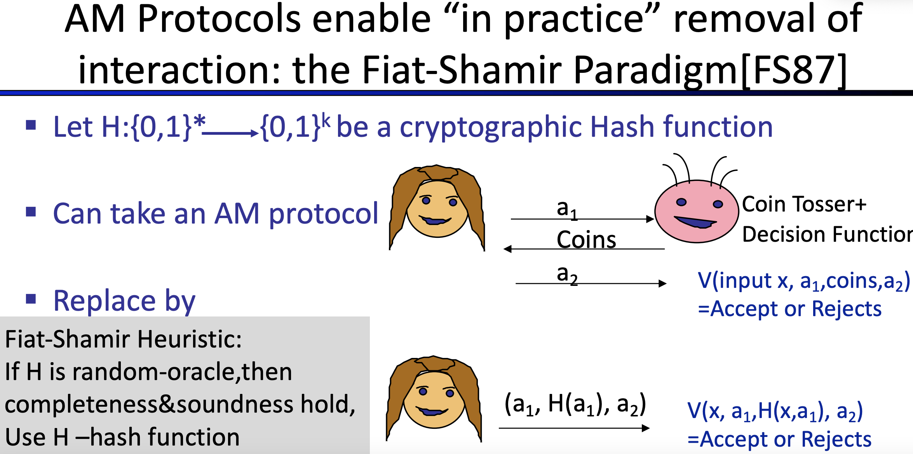

通过 [Fiat-Shamir](https://en.wikipedia.org/wiki/Fiat%E2%80%93Shamir_heuristic) 转换将 Interactive Proof 变为 Non-Interactive Proof

**注:**

